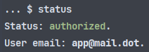
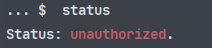
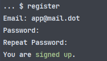
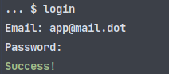

# Simple Login System In Console powered by Python 3

Console commands:
1. `exit` — выйти из программы;
2. `clear` — очистить консоль;
3. `status` — посмотреть текущий статус; 
Если авторизирован:  
 
Иначе: 

4. `register` — зарегистрироваться; 

5. `login` — авторизоваться. 

